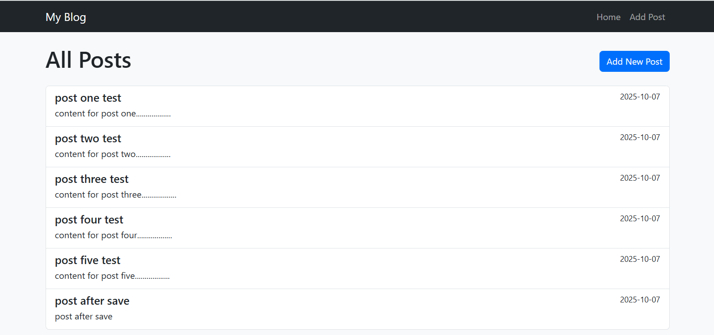
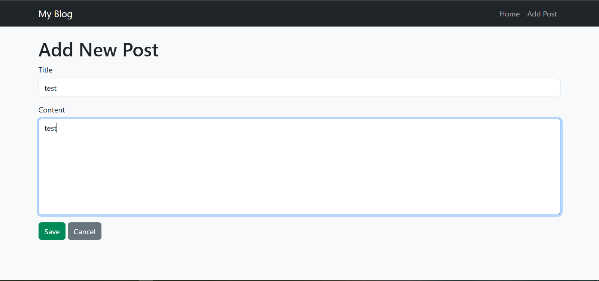
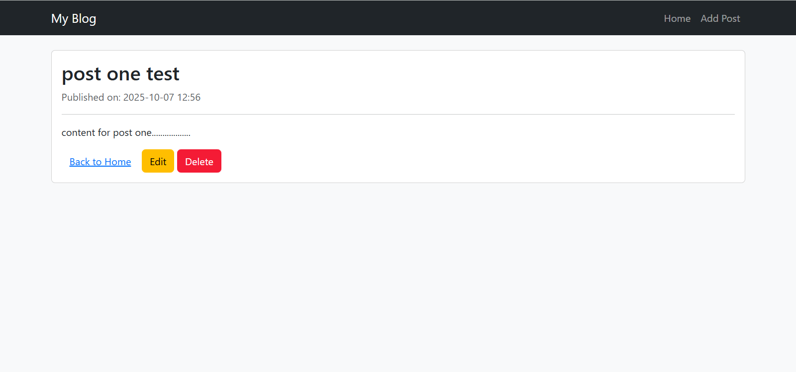
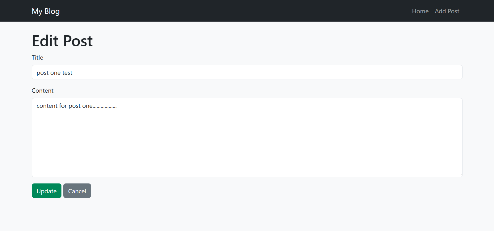
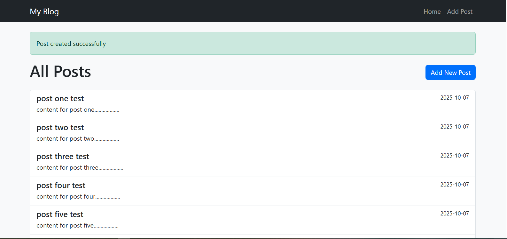
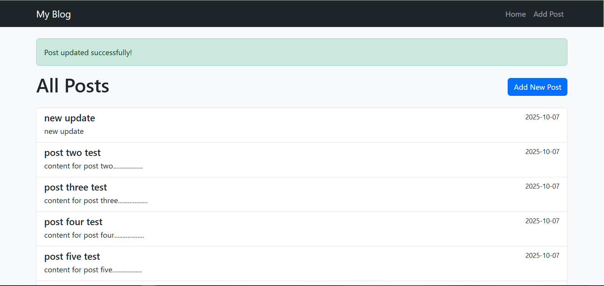

# My Blog (Laravel Project)

## Project Description
A simple personal blog built using the Laravel framework.  
Users can create, view, edit, and delete blog posts with a clean Bootstrap interface.

## Features
- Create, view, edit, and delete posts
- Validation and success messages
- Responsive Bootstrap layout
- Sample data for testing

## Steps to Run the Project
1. Clone this repository:
   ```bash
   git clone https://github.com/adhamelsayed290/my-blog.git

## Screenshots

### Home Page


### Create Post Page


### Show Post Page


### Edit Post Page


### create success Message


### update success Message


### delete success Message


